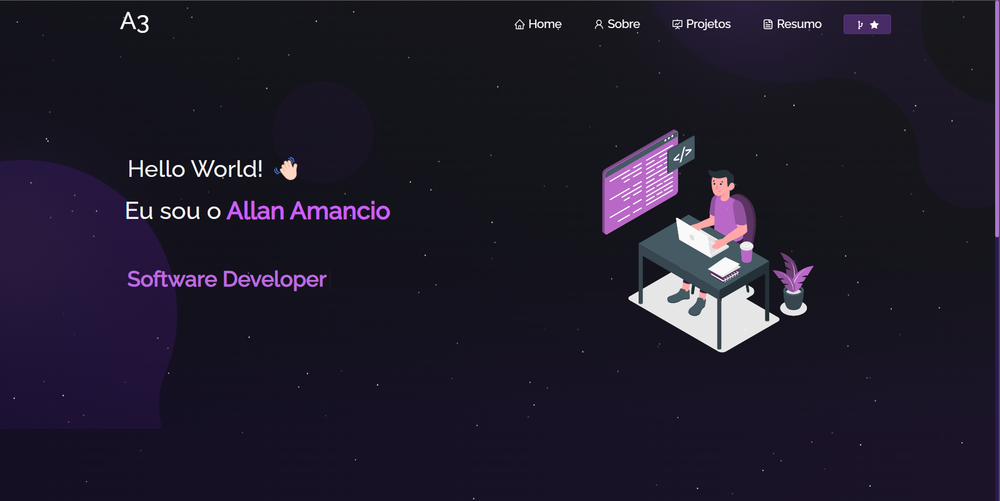

<h2 align="center">
    A3 Portfolio - v1.3 
  <a href="https://allansmithll.github.io/a3-portfolio" target="_blank">Visite meu Portfólio</a>
</h2>

  

 

<h3 align="center">
    🔹
    <a href="https://github.com/allansmithll/a3-portfolio/issues">Reportar Problema</a> &nbsp; &nbsp;
    🔹
    <a href="https://github.com/allansmithll/a3-portfolio/issues">Solicitar Funcionalidade</a>
</h3>

## Construído Com

Meu <a href="https://allansmithll.github.io/a3-portfolio" target="_blank">portfólio pessoal</a>, que apresenta alguns dos meus projetos do GitHub, bem como meu currículo e habilidades técnicas. 

Este projeto foi construído utilizando as seguintes tecnologias:

- React.js
- Node.js
- Express.js
- CSS3
- VsCode
- Vercel

## Recursos

**📖 Layout de Múltiplas Páginas**

**🎨 Estilizado com React-Bootstrap e CSS com cores fáceis de personalizar**

**📱 Totalmente Responsivo**

## Começando

Clone este repositório. Você precisará do `node.js` e do `git` instalados globalmente em sua máquina.

## 🛠 Instalação e Instruções de Configuração

1. Instalação: `npm install`

2. No diretório do projeto, você pode executar: `npm start`

Executa o aplicativo no modo de desenvolvimento.\
Abra [http://localhost:3000](http://localhost:3000) para visualizá-lo no navegador.
A página será recarregada se você fizer edições.

## Direitos Autorais

Este projeto foi originalmente criado por [Soumyajit Behera](https://github.com/soumyajit4419). Qualquer contribuição ou ajuste neste projeto é creditado a ele. Para mais detalhes sobre o projeto original, você pode visitar [o repositório original](https://github.com/soumyajit4419/Portfolio).

## Direitos Autorais Refatorados

Copyright ©2023 Allan Amancio
